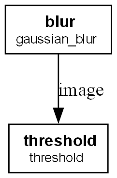

# Pipeoptz

A Python library for the optimization of processing pipelines.

Pipeoptz helps you build a pipepline with the best parameters for your multi-stage processing tasks, such as image processing filters, data cleaning steps, or any sequence of operations where parameter tuning is needed.

## Installation

Clone the repository and install it using pip:

```bash
git clone https://github.com/centralelyon/pipeoptz.git
cd pipeoptz
pip install .
```

This will install the library and its core dependencies.

## Quick Start

Here is a simple example of optimizing an image processing pipeline that consists of a blur and a threshold operation.

### 1. Define your pipeline and objective

First, create a Python script (e.g., `example.py`). Inside, define your pipeline stages and an objective function that scores the pipeline's output.

```python
import cv2
import numpy as np
import matplotlib.pyplot as plt
from pipeoptz import Pipeline, Node, PipelineOptimizer, FloatParameter, IntParameter, mse_loss

# --- Define pipeline stages ---
# These are regular Python functions that will form your pipeline.

def gaussian_blur(image, k, sigma):
    # The kernel size need to be an odd  integer
    k = int(k)*2+1
    return cv2.GaussianBlur(image, (k, k), sigmaX=sigma)

def threshold(image, threshold_value):
    im = image.copy()
    im[cv2.threshold(image, threshold_value, 255, cv2.THRESH_BINARY)[1] == 0] = 0
    return im

# --- Set up the optimization problem ---

# Create dummy input image and ground truth for the example
def generate_data():
    # Input image : a blured & noised circle
    X = np.zeros((100, 100), dtype=np.uint8)
    cv2.circle(X, (50, 50), 30, 150, -1)
    y = np.zeros((100, 100), dtype=np.uint8)
    cv2.circle(y, (50, 50), 30, 150, -1)

    X = cv2.GaussianBlur(X, (21, 21), 10)
    noise = np.zeros(X.shape, np.uint8)
    cv2.randn(noise, 0, 20)
    X = cv2.add(X, noise)
    return X, y

length = 4
X = []
y = []
for _ in range(length):
    Xi, yi = generate_data()
    X.append({"image":Xi})
    y.append(yi)

# Define the pipeline, its nodes and its parameters
# Each parameter is defined with a name and a range [min, max].
pipeline = Pipeline(name="pipeline")
pipeline.add_node(Node(id="blur", func=gaussian_blur, fixed_params={'k': 5, 'sigma': 1.0}), predecessors={'image': 'run_params:image'})
pipeline.add_node(Node(id="threshold", func=threshold, fixed_params={'threshold_value': 127}), predecessors={'image': 'blur'})
```

Now, you have a basic pipeline. You can save it in a special .json format or in .dot to use it with GraphViz (but not all information is saved in the .dot format) and generate with it a PNG with `p.to_dot(filepath="path/file.dot", generate_png=True)`.



---
The next step is to find the best parameters for the pipeline.

```py
# --- Define an objective function ---
# This function evaluates how good the pipeline's output is.
# The optimizer will try to MAXIMIZE the value returned by this function.

# Here we will use the mse_loss function included in the pipeoptz library.
 

# Instantiate the optimizer
optimizer = PipelineOptimizer(
        pipeline=pipeline,
        loss_function=mse_loss,
        max_time_pipeline=0.10, # max time tolerate for 1 run of the pipeline
        X=X, y=y
    )

optimizer.add_param(FloatParameter(node_id='blur', param_name='sigma', min_value=0.1, max_value=20.0))
optimizer.add_param(IntParameter(node_id='blur', param_name='k', min_value=1, max_value=10))
optimizer.add_param(IntParameter(node_id='threshold', param_name='threshold_value', min_value=1, max_value=254))


# --- Run the optimization ---
best_params, loss_log = optimizer.optimize(
        method="ACO", 
        iterations=25,
        ants=10,
        verbose=True
)

# --- View the results ---
print("Optimization finished!")
print(f"Best loss found: {loss_log[-1]}")
print(f"Best parameters: {best_params}")

# You can now use the pipeline with the best parameters
index, history, time = pipeline.run({"image":generate_data[0]})
plt.imshow(history[index])
```

### 2. Run the example

To run this example, you'll need `OpenCV`, `NumPy` and `Matplotlib`.

## How It Works

`Pipeoptz` treats a processing pipeline as a function `f(x, p)` where `x` is the input data and `p` is a set of parameters. The goal is to find the optimal parameters `p*` that maximize an objective function `g(f(x, p*))`.

The `Optimizer` uses a search strategy (like Bayesian Optimization or Grid Search) to explore the parameter space you define. It iteratively:
1.  Selects a new set of parameters.
2.  Executes the pipeline with these parameters.
3.  Evaluates the output with your objective function.
4.  Uses the resulting score to decide which parameters to try next.

This process automates the tedious and often un-intuitive task of manual parameter tuning.